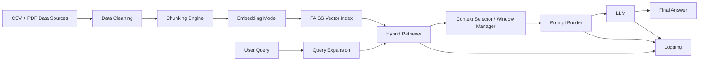

# Student Name: jonatahn ahuche
# Student Index Number: 10022200183

## Architecture Overview

## Data Flow and Component Interactions
- Data is ingested from two domain sources (election CSV and national budget PDF).
- Cleaning normalizes whitespace, removes null bytes, and removes empty records/pages.
- Chunking converts cleaned documents into semantically meaningful units.
- Embeddings are generated for each chunk and indexed in FAISS.
- At query time, query expansion improves recall for domain terms.
- Hybrid retrieval computes weighted score:
  - vector similarity (semantic match)
  - keyword overlap (lexical precision)
- Top chunks are filtered by a context size budget.
- Prompt template injects selected context and strict anti-hallucination instructions.
- LLM returns answer grounded in context.
- Every stage logs outputs for auditability and evaluation.

## Why This Design Fits the Domain
- Budget and election documents include both semantic language and factual tokens (names, numbers, constituencies), so hybrid retrieval improves robustness.
- Chunking at sentence-level preserves local meaning and reduces topic mixing common in large PDF pages.
- Explicit hallucination controls are important for policy and election questions where factual correctness matters.
- Full-stage logging supports academic traceability and manual experiment analysis.

## Innovation Component
- **Domain-specific weighted hybrid retrieval** with query expansion.
- This reduces failures where pure vector similarity misses exact terms (e.g., constituency names, tax labels).
